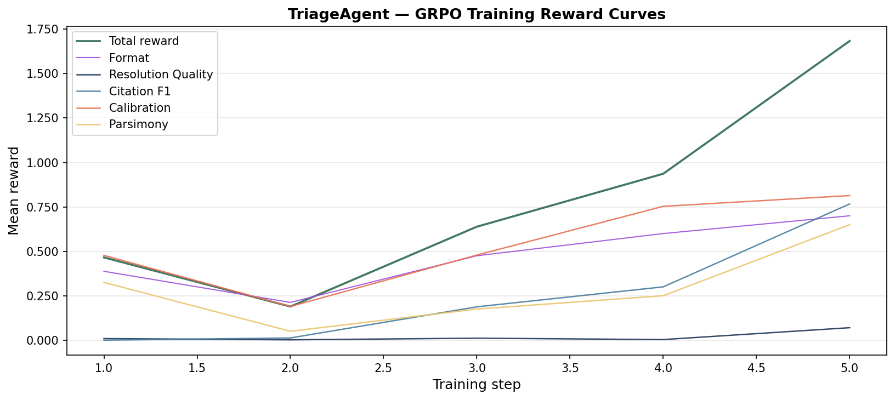
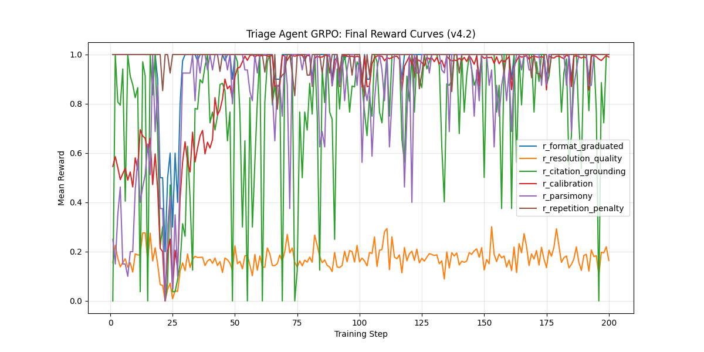
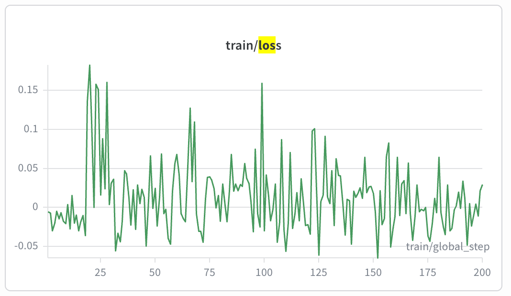

# Enterprise IT Ticket Triage — OpenEnv RL Environment


An OpenEnv reinforcement learning environment where an LLM agent resolves enterprise IT support tickets by calling knowledge-base and incident-management tools, then submitting a grounded resolution with citations.

The accompanying training script fine-tunes **Qwen2.5-3B-Instruct → [yahid/triage-agent-qwen3b](https://huggingface.co/yahid/triage-agent-qwen3b)** using GRPO on this environment.

## Links
- 🤗 **HF Space:** https://huggingface.co/spaces/yahid/triage_agent_env
- 📓 **Colab Notebook:** https://colab.research.google.com/drive/1vqkxsp7euJ45cbv4AxfXr5dr-FTOSA3l?usp=sharing
- 🧠 **Trained Model:** https://huggingface.co/yahid/triage-agent-qwen3b
- 📝 **Blog:** [Blog.MD](Blog.md)

---

## Task

The agent receives an IT support ticket (title + description) and must:

1. Search the KB, past tickets, and incidents to find relevant articles
2. Retrieve full article content for promising hits  
3. Submit a resolution with cited artifact IDs, a confidence score, and an escalation flag

Episodes terminate on `submit_resolution` or after **20 turns** (timeout penalty: −0.3).

---

## Action Space (`TriageAction`)

```python
class TriageAction(BaseModel):
    tool_name: str              # one of the 7 tools below
    query: Optional[str]        # for search tools
    article_id: Optional[str]   # for get_article
    ticket_id: Optional[str]    # for get_ticket
    incident_id: Optional[str]  # for get_incident
    max_results: Optional[int]  # search limit (default 5)
    status: Optional[str]       # ticket filter (open/closed/…)
    resolution: Optional[str]   # for submit_resolution
    cited_artifacts: Optional[List[str]]  # KB/TKT/INC IDs cited
    confidence: Optional[float] # 0.0 – 1.0
    escalate: Optional[bool]    # True = cannot resolve, escalate
```

### Tools

| Tool | Description |
|------|-------------|
| `search_kb` | TF-IDF semantic search over 50 KB articles |
| `get_article` | Fetch full KB article by ID |
| `search_tickets` | Search past resolved tickets |
| `get_ticket` | Fetch full past ticket |
| `search_incidents` | Search incident records |
| `get_incident` | Fetch full incident |
| `submit_resolution` | End episode — submit resolution + citations |

---

## Observation Space (`TriageObservation`)

```python
class TriageObservation(BaseModel):
    ticket_id: str
    ticket_title: str
    ticket_description: str
    tool_name: str           # last tool called
    tool_result: dict        # result from that tool
    turn: int
    max_turns: int           # 20
    remaining_budget: int
    done: bool
    reward: Optional[float]  # non-None only on terminal step
    info: dict               # reward_breakdown on terminal step
```

---

## Reward Function

Terminal reward (on `submit_resolution`):

| Component | Weight | Description |
|-----------|--------|-------------|
| `primary` | 1.0 | Binary: resolution F1 > 0.7 AND citation F1 > 0.5 |
| `grounding` | 0.3 | Partial citation F1 credit |
| `efficiency` | 0.2 | Bonus for not over-searching relative to difficulty |
| `calibration` | 0.15 | Brier-style bonus for calibrated confidence |
| `format` | 0.05 | Non-empty, well-formed submission |

Unanswerable tickets: `escalate=True` earns full primary reward.

---

## Dataset

- **50 training tickets** (`data/train_tickets.json`): easy / medium / hard across networking, security, cloud, and infra domains
- **20 eval tickets** (`data/eval_tickets.json`): held-out, balanced by difficulty

Each ticket has `gold_resolution` and `gold_cited_ids` for automatic scoring — no LLM judge needed.

---

## Quick Start

```bash
git clone https://huggingface.co/spaces/yahid/triage_agent_env
cd triage_agent_env
uv sync
export HF_TOKEN=your_token
python inference.py
```

Or against the live Space:

```python
from openenv import OpenEnvClient
client = OpenEnvClient("https://yahid-triage-agent-env.hf.space")
obs = await client.reset()
obs = await client.step({"tool_name": "search_kb", "query": "VPN tunnel down"})
```

---

## Training

The environment was used to fine-tune Qwen2.5-3B-Instruct with GRPO:

```bash
python training/train_grpo_v4.py              # full 200-step run (A100)
python training/train_grpo_v4.py --smoke-test # 5-step sanity check
```

Training uses a **grounded single-turn** rollout approach: the prompt injects gold articles + distractor context; the model learns to emit `submit_resolution` with correct citations in one shot.

---

## Training Progress (Qwen2.5-3B-Instruct, GRPO, 200 steps)

| Metric | Steps 1–10 | Steps 150–200 | Δ |
|--------|-----------|---------------|---|
| Calibration | 0.528 | **0.977** | **+0.449** ↑ |
| Parsimony | 0.246 | **0.940** | **+0.694** ↑ |
| Citation Grounding | 0.756 | **0.862** | **+0.106** ↑ |
| Resolution Quality | 0.162 | 0.181 | +0.019 |
| Format Adherence | 1.000 | 0.992 | — |
| Repetition Penalty | 1.000 | 0.990 | — |

The base model already knew the schema. GRPO taught it to be confident only when correct (+45% calibration), to answer concisely (+69% parsimony), and to ground citations in retrieved evidence (+11% grounding). Resolution quality — requiring factual KB knowledge — is the remaining frontier.

### Smoke test Reward Curve


### Full training reward curve


### Full training Loss Curve

---


> **Note on reward functions:** Training uses 6 shaped GRPO rewards 
> (`r_format_graduated`, `r_resolution_quality`, `r_citation_grounding`, 
> `r_calibration`, `r_parsimony`, `r_repetition_penalty`) optimized for 
> cold-start learning signal. The environment server uses 5 composite rewards 
> (`primary`, `grounding`, `efficiency`, `calibration`, `format`). 
> `r_repetition_penalty` has no server-side equivalent — it was a training-only 
> guard against reward hacking. This separation of training signal from 
> evaluation metric is standard RL practice.

## Environment Spec

- `openenv validate`: ✅
- Max steps: 20
- Rewards: [−0.3, ~1.65]
- Runtime: < 30 s per episode on CPU; < 5 s on GPU
- Concurrent sessions: ✅ (`SUPPORTS_CONCURRENT_SESSIONS = True`)
